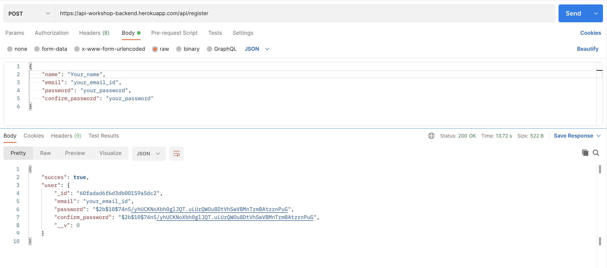
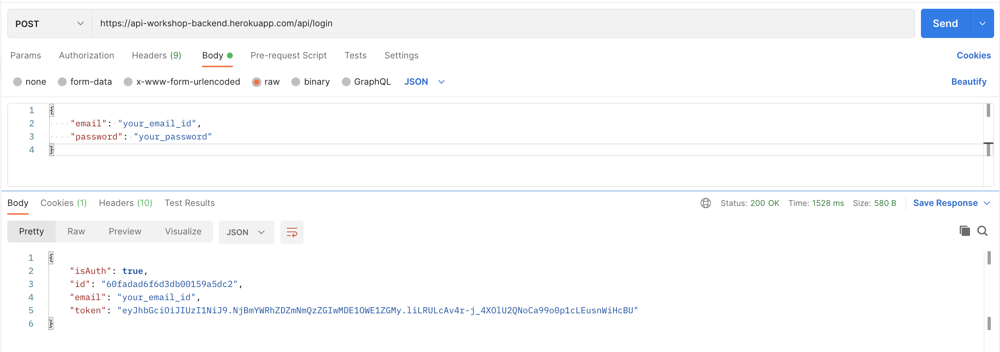
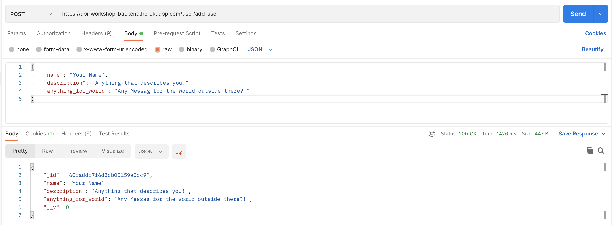

# API_2.0
This repo contains all the code required for the Postman API 2.0 Workshop 😃

### Project Structure


- `backend` - This folder contains all the backend related code while includes Server code, APIs and middlewares

- `workshop-frontend` - This frontend contains all the frontend related code.

### HOSTED URLs

The backend and frontend of this repository is hosted separately and you can find it at the below links -

- Frontend Hosted URL - https://workshop-frontend.netlify.app/

- Backend Hosted URL - https://api-workshop-backend.herokuapp.com/


## Add your detail to the live website

Please follow the below steps in order to ee your details at https://workshop-frontend.netlify.app/

1. Visit postman web at https://web.postman.co/
2. Register Yourself 🖥️

   Please follow the below steps to register yourself -
   - Select the Request type sas `POST`
   - Put the URL as `https://api-workshop-backend.herokuapp.com/api/register`
   - Select Body -> JSON(from type dropdown) and fill teh below details in there
   ```
   {
      "name": "",
      "email": "",
      "password": "",
      "confirm_password": ""
    }
    ```
    - Click on the `send` button
    - You should get a status of 200 showing that your request is done correctly

please see the below screenshot to take the reference of the input and output data



3. Login Yourself 🔐

   Please follow the below steps to register yourself -
   - Select the Request type sas `POST`
   - Put the URL as `https://api-workshop-backend.herokuapp.com/api/login`
   - Select Body -> JSON(from type dropdown) and fill teh below details in there
   ```
   {
      "email": "",
      "password": ""
    }
    ```
    - Click on the `send` button
    - You should get a status of 200 showing that your request is done correctly

please see the below screenshot to take the reference of the input and output data



4. Add your details to the Database 💾

   Please follow the below steps to register yourself -
   - Select the Request type sas `POST`
   - Put the URL as `https://api-workshop-backend.herokuapp.com/user/add-user`
   - Select Body -> JSON(from type dropdown) and fill teh below details in there
   ```
   {
      "name": "",
      "description": "",
      "anything_for_world": ""
    }
    ```
    - Click on the `send` button
    - You should get a status of 200 showing that your request is done correctly

please see the below screenshot to take the reference of the input and output data



5. Visit the [webiste](https://workshop-frontend.netlify.app/) and see your details added in there 😄

Please feel free to come up with a PR if you think this repo needs any kind of improvement!
